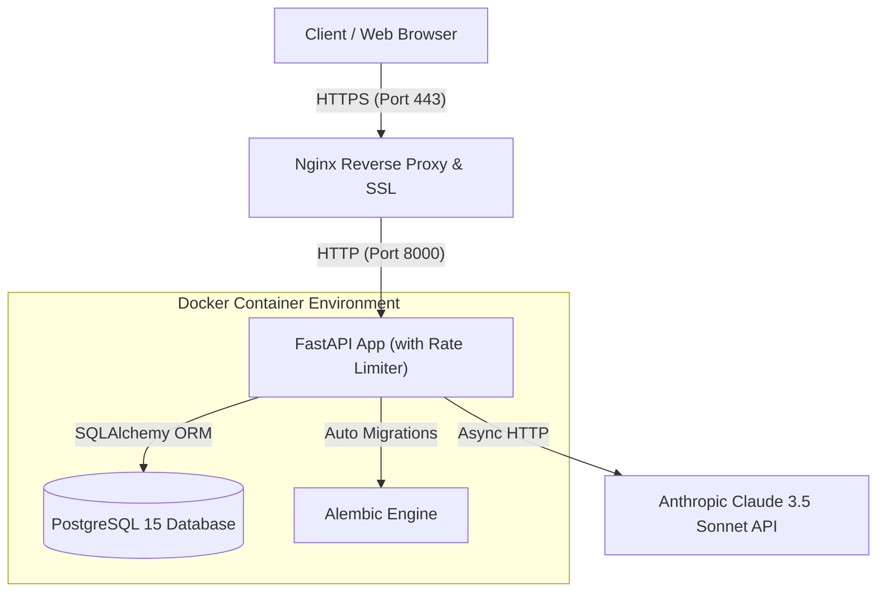

# Cloud Notes API: Production-Ready Cloud & AI Architecture
[](https://16.16.110.208.sslip.io/docs)


The **Cloud Notes API** is a high-performance, containerized backend application engineered with **FastAPI**, **PostgreSQL**, **Anthropic Claude 3.5 Sonnet**, and **Docker**. Built following cloud security best practices, automated testing, and CI/CD deployment standards.

---

## 🔗 Live Interactive API Documentation
Try out the live endpoints directly in your browser:
* **Interactive Swagger UI (HTTPS):** [https://16.16.110.208.sslip.io/docs](https://16.16.110.208.sslip.io/docs)
* **ReDoc OpenAPI Documentation:** [https://16.16.110.208.sslip.io/redoc](https://16.16.110.208.sslip.io/redoc)
* **Health Check:** `https://16.16.110.208.sslip.io/health`

---

## 🏗️ System Architecture



---

## 🌟 Core Engineering Practices

### 1. Cloud Security & Rate Limiting
* **Stateless JWT Authentication:** Secure password hashing via Argon2/Bcrypt and signed OAuth2 Bearer JSON Web Tokens.
* **Rate Limiting (`slowapi`):** API endpoints (specifically AI generation) are protected with rate-limiting rules (`10 requests/min`) to safeguard against denial-of-service or API quota abuse.
* **Strict Authorization Scoping:** Ownership verification (`owner_id == current_user.id`) enforced directly at database query boundaries.

### 2. Modern DevOps & Infrastructure as Code (IaC)
* **Terraform Provisioning:** Declarative HCL code (`terraform/`) provisioning EC2 instances, custom Security Group rules, and GP3 EBS storage.
* **Automated CI/CD:** GitHub Actions workflow automatically builds, runs `pytest`, and deploys updates to AWS EC2 via SSH upon merging to `main`.
* **Multi-Stage Docker Containerization:** Optimized dual-stage container build producing lightweight, production-ready images.

### 3. AI & Natural Language Integration
* **Intelligent Note Summarization:** Leverages Claude 3.5 Sonnet to generate concise summaries.
* **Automated Topic Tagging:** Dynamically extracts and assigns structured topic tags.
* **RAG-lite Q&A (`ask_notes`):** Answers natural language queries over the user's note collection with source attribution.

---

## 🧪 Testing & Quality Assurance

Automated unit and integration testing is implemented using `pytest` and `httpx`.

```bash
# Run test suite locally
pytest -v --cov=app
```

---

## 🚀 Rapid Local Setup with Docker

1. **Clone the repository:**
   ```bash
   git clone https://github.com/your-username/Cloud_Notes_API.git
   cd Cloud_Notes_API
   ```

2. **Configure Environment Variables:**
   Copy `.env.example` to `.env` and fill in your Anthropic API Key:
   ```bash
   cp .env.example .env
   ```

3. **Launch Stack:**
   ```bash
   docker compose up -d --build
   ```

4. **Access Local API:**
   Navigate to `http://localhost:8000/docs` in your browser.

---

## 👨‍💻 Author

**Taha Khallaf**  
Backend & DevOps Engineer  
*Enrolled in GCI 2026 | Pursuing Software Engineering & Cloud Careers in Japan*
